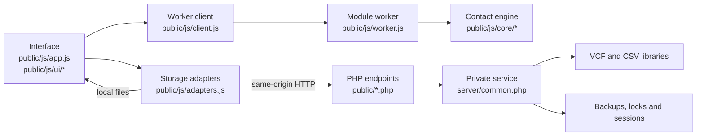
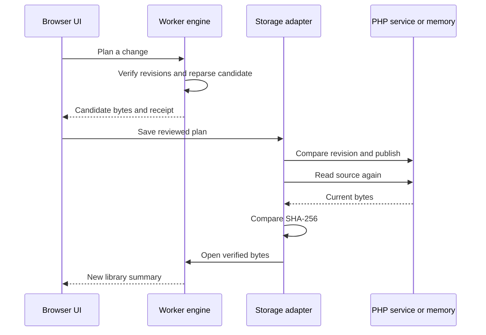

# Contacts Hub Architecture

Contacts Hub is a browser contact workspace with two storage modes. Local mode opens VCF and CSV files from the device and keeps changes in memory until an edited VCF is downloaded. Server mode connects the same interface to authenticated PHP endpoints that enumerate, read and replace contact libraries under revision control.

The browser owns parsing, indexing, search, change planning and presentation. The PHP service owns authentication, guarded filesystem access, backups, locking and persistent publication. Neither side treats a successful write response as proof: the browser reads the saved file back and compares its SHA-256 revision before publishing the new state to the interface.

---

## Component Map



`public/js/app.js` coordinates the workspace and renders the interface. `public/js/client.js` sends bounded requests to one module worker, while `public/js/worker.js` exposes `ContactEngine.handle()` across the worker boundary. Parsing and queries therefore run away from the browser's main thread. Worker timeouts or failures replace the worker and reject outstanding work without touching persisted files (`public/js/client.js`, `EngineClient`).

`public/js/adapters.js` provides the storage boundary. `FileAdapter` reads selected device files and delegates session-only changes to `MemoryAdapter`. `PHPAdapter` calls the same-origin session, catalogue, read and write endpoints. `commitPlan()` is shared by both modes and publishes a change to the engine only after storage read-back matches the planned revision.

---

## Interface

The desktop interface uses three side-by-side panes: a 280 px library pane, a 360 px contact-list pane and a detail pane that takes the remaining width (`public/assets/app.css`, `.pane-libraries`, `.pane-list` and `.pane-detail`). At widths from 769 px to 1,150 px, the first two panes narrow to 240 px and 310 px. At 768 px or below, `body[data-pane]` shows one pane at a time and the interface supplies explicit back navigation.

The library pane holds the four views, library catalogue, source-opening controls, theme switch and Settings. The list pane contains search, source actions, an 80-row virtual window, keyboard control and an alphabet gutter. The detail pane renders the selected contact, review warnings, source evidence, validated quick actions and edit or delete controls (`public/index.html`; `public/js/app.js`, `renderShell()` and `renderDetail()`; `public/js/ui/virtual-list.js`, `ContactList`).

One reusable modal hosts sign-in, source selection, contact editing, change review, source details, CSV mapping and import, shared-detail comparison, Settings and new-library creation. Focus is trapped inside an open modal, Escape follows the dialog's controlled close path, and the active element is restored after closing (`public/js/app.js`, `dialog()`, `closeDialog()` and the modal key handler).

Settings controls preference retention, search scope, change-receipt export and clearing, new-library creation and workspace closure. It ends with source limits followed by the About section from `public/js/ui/about.js`, which credits Nauman Shahid and links the portfolio, GitHub, LinkedIn and Ko-fi without sending a referrer (`public/js/app.js`, `settingsDialog()`; `public/js/ui/about.js`, `aboutSection()`).

Device storage is deliberately narrow. `localStorage` key `nexus.preferences.v2` holds the favourites array, the My Card bookmark, the remember flag and theme. Favourites and My Card are SHA-256 bookmarks rather than contact values. Contact text, source bytes, CSRF authority and change receipts remain in memory (`public/js/app.js`, `preferences()` and `storePreferences()`).

My Card can be pinned manually from a contact or discovered automatically from `MY_NAME` when exactly one case-insensitive display-name match appears in a bounded query. It sorts first and receives its badge without changing the source record. Favourites use the same bookmark mechanism and remain a separate view (`public/js/app.js`, `openLibrary()`, `renderDetail()` and `renderShell()`; `public/js/core/engine.js`, `queryContacts()`).

---

## Browser Data Flow

Opening a library follows this path:

1. The active adapter returns a catalogue entry and raw source text (`public/js/adapters.js`, `catalogue()` and `read()`).
2. The adapter validates the filename, source size and UTF-8 bytes before returning the text (`public/js/core/primitives.js`, `safeFilename()` and `decodeBytes()`).
3. `EngineClient` transfers the text to the module worker (`public/js/client.js`, `request()`).
4. `parseLibrary()` selects the VCF or CSV parser and builds the indexed library (`public/js/core/engine.js`, `parseLibrary()` and `indexLibrary()`).
5. The engine returns a summary rather than the full parsed source. Contact rows and detail records are requested as bounded views (`public/js/core/engine.js`, `summaryOf()`, `queryContacts()` and `detailOf()`).
6. `ContactList` renders a moving window of 80 rows against a spacer representing the complete result set (`public/js/ui/virtual-list.js`, `ContactList.load()`).

The engine keeps opened libraries in worker memory. A 64 MiB byte ceiling and a 100,000-contact ceiling apply across the open workspace. Each source is separately limited to 20 MiB and 50,000 contacts (`public/js/core/primitives.js`, `LIMITS`; `public/js/core/engine.js`, `ContactEngine.open()`).

---

## VCF Model

`parseVCard()` records the original library text and constructs one contact per card with byte-splice offsets, source line numbers, the raw card and its SHA-256 hash. Every parsed property keeps its original text, header, group, parameters and line. Supported display fields, diagnostics, editability and a stable hashed bookmark sit beside that source evidence (`public/js/core/vcard.js`, `parseVCard()`).

Physical lines are unfolded without discarding their original ranges. Space and tab continuations are supported. Quoted-printable values support UTF-8, ISO-8859-1, Windows-1252 and US-ASCII; a malformed or unsupported value remains visible in encoded form and makes the card read-only (`public/js/core/vcard.js`, `physicalLines()` and `decodedProperty()`).

VCF 3.0 and 4.0 cards are editable when each card is closed, contains exactly one supported `VERSION`, and has no property the parser failed to interpret. Earlier versions, malformed cards, stray text and unclosed cards remain readable. A parser error blocks in-place writes for the whole library so an incomplete interpretation cannot silently destroy source data (`public/js/core/vcard.js`, `parseVCard()`).

### Loss-preserving edits

`patchCard()` operates on one original card. It rewrites only fields changed in the editor, splices replacements against recorded source offsets and retains every unrelated byte. Unknown properties, unedited supported properties, ordering and the library's line ending survive ordinary edits. Grouped Apple-style labels remain attached to their values; changing a label on an ungrouped property creates a dedicated group instead of guessing at source intent (`public/js/core/vcard.js`, `patchCard()`).

New contacts, CSV conversions and selective imports use `newVCard()`. They are emitted as folded VCF 3.0 cards with CRLF line endings, generated UIDs and grouped labels. Imported cards carry `X-NEXUS-SOURCE`, and converted CSV cards also carry the original headers and row cells in `X-NEXUS-CSV-ROW` (`public/js/core/vcard.js`, `newVCard()`).

---

## CSV Model

`tokenizeCSV()` implements quoted RFC 4180 fields and accepts comma, semicolon or tab as the selected delimiter. It records row offsets and line ranges, retains embedded line breaks and reports malformed quoting instead of repairing it by guesswork (`public/js/core/csv.js`, `tokenizeCSV()`).

`parseContactCSV()` treats the first row as headers. Common contact-export headings are inferred case-insensitively, while the interface can replace that inference with an explicit column-index mapping. Numbered phone, email, website and formatted-address columns are recognised, `:::` separates repeated values inside supported cells, and unmapped values remain in `extras`. Every parsed contact keeps the source headers and cells for later conversion evidence (`public/js/core/csv.js`, `CSV_ALIASES`, `inferMapping()` and `parseContactCSV()`).

CSV libraries are read-only. A library becomes convertible only when parsing produced no errors and every row has a mapped full name. Conversion always creates a new VCF and leaves the CSV unchanged (`public/js/core/engine.js`, `convertLibrary()`).

---

## Search and Review

Indexing derives search text, short-field fuzzy targets, phone keys, email keys and quality findings without changing source values (`public/js/core/engine.js`, `indexLibrary()`).

A query matches when every typed word appears literally in the accent-folded search text, when three or more typed digits appear in a normalised phone key, or when the query's letters appear in order inside one short field such as a name, organisation, title, nickname, phone or email (`public/js/core/engine.js`, `matchesQuery()`). Notes and addresses do not become broad fuzzy targets. Query text is treated as text, never as a regular expression.

Phone keys preserve the distinction between local and international forms. `+` and `00` forms can match one another, Arabic-Indic, Persian and full-width digits are mapped to ASCII, and extensions remain part of the key. No country code is invented for a local number (`public/js/core/primitives.js`, `asciiDigits()` and `phoneKey()`). Email keys use NFC normalisation and case folding for review candidates (`public/js/core/primitives.js`, `emailKey()`).

Shared phone or email keys create review groups, not duplicate declarations. `combineDetails()` can fill empty scalar fields and append exact missing values from another record, but conflicting values remain reported and both records remain distinct (`public/js/core/engine.js`, `matchGroups()` and `combineDetails()`).

---

## Change Transaction



`planChange()` requires the source revision captured when the draft opened. An edit or deletion also requires the original card hash. The planned complete file is reparsed before it leaves the worker and must produce a writable library (`public/js/core/engine.js`, `planChange()`).

Before transport, `checkReceiptCapacity()` confirms that the session can retain the next change receipt. The user then sees the affected library, contact count and changed fields, and can download the proposed VCF before saving (`public/js/adapters.js`, `checkReceiptCapacity()`; `public/js/app.js`, `previewPlan()`).

In local mode, the plan changes only the in-memory session copy. In server mode, `write.php` validates the request and source, takes an exclusive library lock, compares the current SHA-256 revision, writes an exact backup of an existing source, creates an owner-only temporary file, flushes it, checks the source again and publishes by same-filesystem rename. The endpoint then reads the file back before responding (`public/write.php`; `server/common.php`, `nexus_validate_vcf()`, `nexus_backup()` and `nexus_write_new()`).

The browser independently reads the published file and compares its revision with the plan. A matching read-back can recover a successful write whose response was lost. A failed read-back or different revision leaves the library marked uncertain and blocks further editing until reload (`public/js/adapters.js`, `commitPlan()`; `public/js/app.js`, `previewPlan()`).

---

## Server Boundary

`public/bootstrap.php` locates the private service through `NEXUS_PRIVATE_PATH`, a sibling `server/` directory, or `public/server/`. Each endpoint then runs through `nexus_run()`, which loads and validates configuration, checks the HTTP method, opens the session, requires authentication where applicable, applies request protection to writes and releases the session before long file work (`server/common.php`, `nexus_run()`).

| Endpoint | Method | Purpose |
|:--|:--|:--|
| `public/session.php` | `GET`, `POST` | Session status, password login and logout |
| `public/scan.php` | `GET` | Bounded catalogue of supported regular VCF and CSV files |
| `public/read.php` | `GET` | Locked read of one validated source filename |
| `public/write.php` | `POST` | Revision-checked VCF creation or replacement |

Authentication supports a password verified by PHP's password API or a non-empty `REMOTE_USER` set by the web server. File-backed sessions live in the configured private session directory. The cookie is HttpOnly, SameSite Strict, scoped to the application path and controlled by `secure_cookie` (`server/common.php`, `nexus_start_session()` and `nexus_authenticated()`).

All endpoint responses are private and uncacheable. The service also sets `X-Content-Type-Options: nosniff`, `Referrer-Policy: no-referrer`, `X-Frame-Options: DENY` and an `X-Robots-Tag` exclusion. Unexpected failures log only the exception class and return a generic message (`server/common.php`).

Apache deployments receive another boundary from the shipped dotfiles. `public/.htaccess` disables directory indexes, blocks direct requests for library and service-state extensions, and adds response protections. `server/.htaccess` denies all HTTP access to the private service directory. The `public/js/.htaccess` and `public/assets/.htaccess` files require browser revalidation so stale modules and styles do not remain authoritative after an update.

---

## Data Structures and Limits

The core browser ceilings are defined once in `public/js/core/primitives.js` as `LIMITS`. The PHP configuration cannot raise the source, library or per-source contact ceilings beyond that browser contract (`server/common.php`, `nexus_config()`).

| Resource | Limit |
|:--|--:|
| One source | 20 MiB |
| Open source bytes | 64 MiB |
| Contacts per source | 50,000 |
| Contacts across open sources | 100,000 |
| Catalogue entries | 2,000 |
| Properties per vCard | 2,048 |
| One vCard | 1 MiB |
| One text field | 131,072 characters |
| CSV columns | 256 |
| Stored diagnostics per library | 200 |
| Search query | 256 characters |
| Shared-detail key space | 250,000 keys |
| Shared-detail groups | 200,000 groups |
| Embedded photo preview | 512 KiB and 2,048 × 2,048 pixels |
| Session change receipts | 1,000 receipts or 8 MiB |

`ContactEngine` caches the most recent complete query row set under an epoch that changes whenever a library opens, closes or clears. Subsequent scroll windows slice that cached result. The DOM keeps at most 80 rows mounted, while the spacer preserves complete scroll, keyboard and alphabet navigation (`public/js/core/engine.js`, `ContactEngine.handle()`; `public/js/ui/virtual-list.js`).

---

## Exports and Inspection Tools

The interface can export the original source, an inspection CSV, one vCard or complete evidence JSON. Spreadsheet-formula prefixes are escaped in CSV output (`public/js/core/primitives.js`, `csvCell()`; `public/js/core/engine.js`, `exportTable()`). Evidence JSON contains the original source text, interpretation, revision, parsed records, raw spans, normalised keys, findings and shared-detail groups (`public/js/core/engine.js`, `exportEvidence()`).

`tools/nexus.mjs` prints counts and findings without contact values by default. Content export requires both a format and output path plus `--include-content`, and `tools/io.mjs::writeNew()` refuses an existing target.

`tools/relational.mjs` verifies that an evidence export's source checksum is valid, reparses the embedded source and requires the entire evidence object to match the fresh parse. Only then does it emit relational rows. `tools/sqlite.py` loads those rows into a new SQLite database, runs integrity and foreign-key checks, flushes the temporary database and publishes it with a hard link that refuses an existing target.

---

## Verification

```bash
npm test
npm run check
npm run test:php
npm run test:browser
npm run test:performance
npm run benchmark -- 10000
```

`npm test` exercises parsing, loss-preserving edits, search, matching, adapters, worker recovery, the static inspection server and evidence tooling. `npm run check` validates JavaScript and available PHP syntax, import targets, required files, absent private or publication surfaces, browser construction rules, CSP and public/private separation (`tools/check.mjs`).

The PHP gate creates an isolated deployment and tests password and remote-user authentication, CSRF rejection, private source reads, revision conflicts, backups and both separated and site-root library layouts (`tests/php_gate.mjs`). The browser and performance gates require Playwright and Chromium. They use locally installed Playwright when available; `NEXUS_BROWSER_TOOLS` supplies an external installation when it is not. `NEXUS_CHROMIUM` can select a Chromium executable (`tests/browser_gate.mjs`, `tests/performance_gate.mjs`).

The benchmark generates a synthetic VCF and reports parse, first-search, cached-window and peak-RSS measurements. The count must be between 1 and 50,000; the report describes one Node run and makes no browser or leak guarantee (`tools/benchmark.mjs`).

---

<div align="center">
<br>

**_Architected by Nauman Shahid_**

<br>

[](https://www.nauman.cc)
[](https://github.com/nshah1d)
[](https://www.linkedin.com/in/nshah1d/)

</div>
<br>

Licensed under the [MIT Licence](../LICENSE). Bundled Inter and JetBrains Mono fonts are licensed under the SIL Open Font License 1.1: [Inter licence](../public/assets/fonts/Inter-LICENSE.txt) and [JetBrains Mono licence](../public/assets/fonts/JetBrainsMono-LICENSE.txt).
